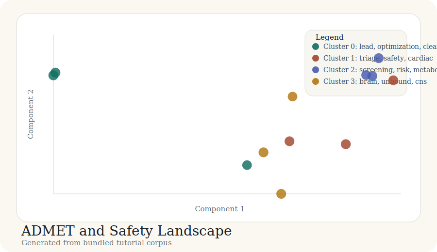

# Tutorial: ADMET and Safety Landscape

This tutorial covers an early-discovery ADMET and safety corpus. The outputs are
generated from `docs/tutorial-data/admet-safety-landscape.csv` by
`scripts/build_case_studies.py`.

## Background

ADMET and discovery safety portfolios are usually mixtures of PK, transporter,
cardiac safety, reactive metabolite, mitochondrial, and CNS exposure work.

## Purpose

The goal is to show whether those liabilities and support workflows separate
into coherent map regions.

## Data used

The bundled corpus contains 12 records covering clearance, cardiac safety,
discovery toxicology, and CNS exposure topics.

## Code used

```python
records = load_records(DATA_DIR / "admet-safety-landscape.csv")
vocab, vectors, _ = build_tfidf(records)
centered, _ = center_vectors(vectors)
coords = project(centered, top_components(centered, 2))
labels, centroids = kmeans(vectors, 4)
```

## Results



| Cluster | Theme | Size | Mean probability |
| --- | --- | ---: | ---: |
| 0 | lead, optimization, clearance | 3 | 0.83 |
| 1 | triage, safety, cardiac | 3 | 0.82 |
| 2 | screening, risk, metabolite | 3 | 0.81 |
| 3 | brain, unbound, cns | 3 | 0.81 |

## Bundled artifacts

- [labels.csv](../case-studies/admet-safety-landscape/labels.csv)
- [cluster_summary.csv](../case-studies/admet-safety-landscape/cluster_summary.csv)
- [coords_2d.csv](../case-studies/admet-safety-landscape/coords_2d.csv)
- [map_interactive.html](../case-studies/admet-safety-landscape/map_interactive.html)

## Interpretation

This example is helpful because it mirrors how medicinal chemistry teams think:
exposure, cardiac safety, toxicology alerts, and CNS design constraints appear
as separate but related discovery conversations.
