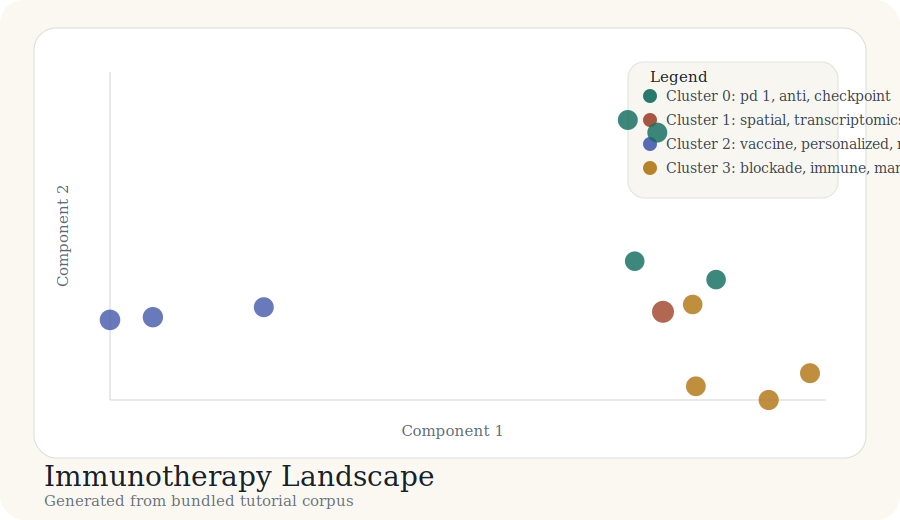

# Tutorial: Immunotherapy Landscape

This tutorial models a literature-mapping run for an immunotherapy-focused
corpus. The point is not just to configure the package, but to show what the
end of a good run should look like.

The outputs linked below are generated from the bundled corpus in
`docs/tutorial-data/immunotherapy-landscape.csv` by
`scripts/build_case_studies.py`.

## Goal

Produce a literature map with:

- paper-level cluster assignments
- a cluster summary table
- two-dimensional coordinates
- an interactive HTML report

## Corpus sketch

This case study assumes a title-and-abstract corpus centered on cancer
immunotherapy and biomarkers.

## Result snapshot

### Cluster summary

| Cluster | Theme | Size | Mean probability |
| --- | --- | ---: | ---: |
| 0 | pd 1, anti, checkpoint | 4 | 0.78 |
| 1 | spatial, transcriptomics, architecture | 1 | 1.00 |
| 2 | vaccine, personalized, neoantigen | 3 | 0.83 |
| 3 | blockade, immune, management | 4 | 0.79 |

### Representative records

| Cluster | Representative titles |
| --- | --- |
| 0 | Single-cell atlases of response to anti PD-1 therapy; Interferon gamma response as a checkpoint response marker |
| 1 | Spatial transcriptomics for tumor microenvironment profiling |
| 2 | Neoantigen selection strategies for vaccine design; Personalized peptide vaccines after tumor sequencing |
| 3 | Case report of rare toxicity under combined blockade; Multiplex imaging of immune niches under checkpoint blockade |

## Bundled artifacts

- [labels.csv](../case-studies/immunotherapy-landscape/labels.csv)
- [cluster_summary.csv](../case-studies/immunotherapy-landscape/cluster_summary.csv)
- [coords_2d.csv](../case-studies/immunotherapy-landscape/coords_2d.csv)
- [map_interactive.html](../case-studies/immunotherapy-landscape/map_interactive.html)

## Interpretation

The visible separation between checkpoint-oriented papers, vaccine-oriented
papers, and adverse-event management papers is a display-space convenience. The
clusters themselves are defined in the analysis backend, not by the final
two-dimensional layout.
