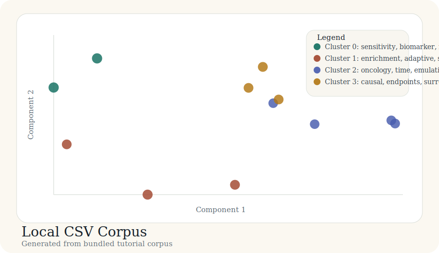

# Tutorial: Local CSV Corpus

Not every literature workflow starts from an API. This tutorial covers the case
where a team already has a curated bibliography in a local CSV file.

The outputs linked below are generated from the bundled corpus in
`docs/tutorial-data/local-csv-corpus.csv` by
`scripts/build_case_studies.py`.

## Scenario

You have a manually assembled review corpus with titles, abstracts, years, and
source identifiers. You want the same artifact discipline as an API-based run.

## Result snapshot

### Cluster summary

| Cluster | Theme | Size | Mean probability |
| --- | --- | ---: | ---: |
| 0 | sensitivity, biomarker, mediation | 2 | 0.90 |
| 1 | enrichment, adaptive, survey | 3 | 0.83 |
| 2 | oncology, time, emulation | 4 | 0.77 |
| 3 | causal, endpoints, surrogate | 3 | 0.81 |

### Output checklist

| Artifact | Purpose |
| --- | --- |
| `papers.parquet` | normalized internal corpus |
| `text_inputs.csv` | exact strings sent to the embedder |
| `labels.csv` | paper-level cluster labels |
| `cluster_summary.csv` | cluster-level summary |
| `coords_2d.csv` | plotting coordinates |
| `map_interactive.html` | final interactive report |

## Bundled artifacts

- [labels.csv](../case-studies/local-csv-corpus/labels.csv)
- [cluster_summary.csv](../case-studies/local-csv-corpus/cluster_summary.csv)
- [coords_2d.csv](../case-studies/local-csv-corpus/coords_2d.csv)
- [map_interactive.html](../case-studies/local-csv-corpus/map_interactive.html)

## Takeaway

The value of `litmap` is not tied to PubMed. A local CSV corpus should produce
the same category of artifacts and the same explanation surface as any other
source.
