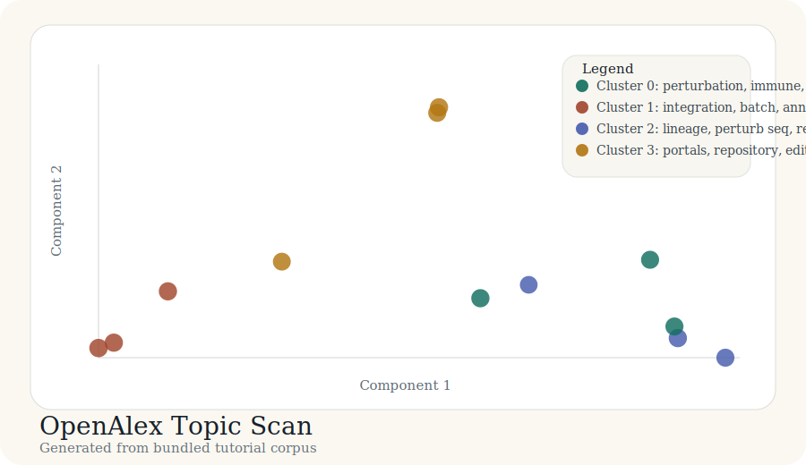

# Tutorial: OpenAlex Topic Scan

This tutorial shows how `litmap` documentation should handle a broad,
cross-source discovery pass. The scenario here is an OpenAlex-based scan around
single-cell perturbation screens.

The outputs linked below are generated from the bundled corpus in
`docs/tutorial-data/openalex-topic-scan.csv` by
`scripts/build_case_studies.py`.

## Question

What major topic islands appear when we cluster a recent methods-heavy corpus?

## Result snapshot

### Cluster summary

| Cluster | Theme | Size | Mean probability |
| --- | --- | ---: | ---: |
| 0 | perturbation, immune, signaling | 3 | 0.83 |
| 1 | integration, batch, annotation | 3 | 0.84 |
| 2 | lineage, perturb seq, recording | 3 | 0.81 |
| 3 | portals, repository, editorial | 3 | 0.82 |

## Bundled artifacts

- [labels.csv](../case-studies/openalex-topic-scan/labels.csv)
- [cluster_summary.csv](../case-studies/openalex-topic-scan/cluster_summary.csv)
- [coords_2d.csv](../case-studies/openalex-topic-scan/coords_2d.csv)
- [map_interactive.html](../case-studies/openalex-topic-scan/map_interactive.html)

## Why this tutorial matters

This is the kind of tutorial that tells a user whether the package can handle
"search a domain and show me the landscape" rather than just "load a local
table and print a plan".
