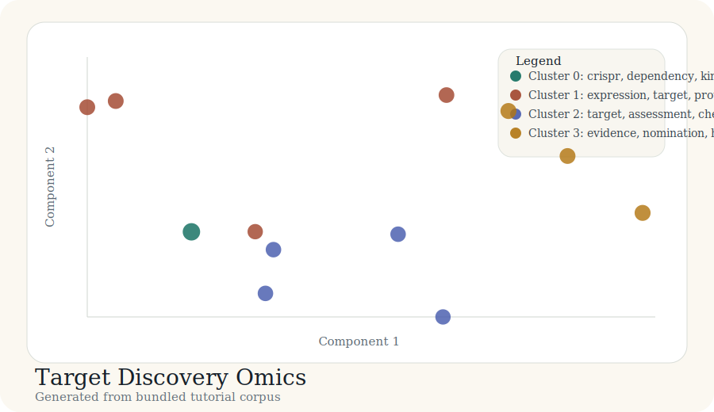

# Tutorial: Target Discovery Omics

This tutorial is a drug-discovery-facing example centered on target nomination.
The outputs are generated from the bundled corpus in
`docs/tutorial-data/target-discovery-omics.csv` by
`scripts/build_case_studies.py`.

## Background

Target discovery programs often bring together functional genomics, tissue
context mapping, tractability assessment, and genetics-backed prioritization.

## Purpose

The goal is to see whether a compact corpus separates those discovery themes
into interpretable clusters.

## Data used

The bundled corpus contains 12 records spanning CRISPR screens, spatial and
single-cell mapping, chemoproteomics, and human genetics evidence.

## Code used

```python
records = load_records(DATA_DIR / "target-discovery-omics.csv")
vocab, vectors, _ = build_tfidf(records)
centered, _ = center_vectors(vectors)
coords = project(centered, top_components(centered, 2))
labels, centroids = kmeans(vectors, 4)
```

## Results



| Cluster | Theme | Size | Mean probability |
| --- | --- | ---: | ---: |
| 0 | crispr, dependency, kinase | 1 | 1.00 |
| 1 | expression, target, proteomics | 4 | 0.78 |
| 2 | target, assessment, chemoproteomics | 4 | 0.76 |
| 3 | evidence, nomination, human | 3 | 0.81 |

## Bundled artifacts

- [labels.csv](../case-studies/target-discovery-omics/labels.csv)
- [cluster_summary.csv](../case-studies/target-discovery-omics/cluster_summary.csv)
- [coords_2d.csv](../case-studies/target-discovery-omics/coords_2d.csv)
- [map_interactive.html](../case-studies/target-discovery-omics/map_interactive.html)

## Interpretation

The map separates discovery evidence modes in a way that is useful for portfolio
triage: functional dependence, target-context profiling, tractability, and
human-genetics support are all visible as distinct clusters.
