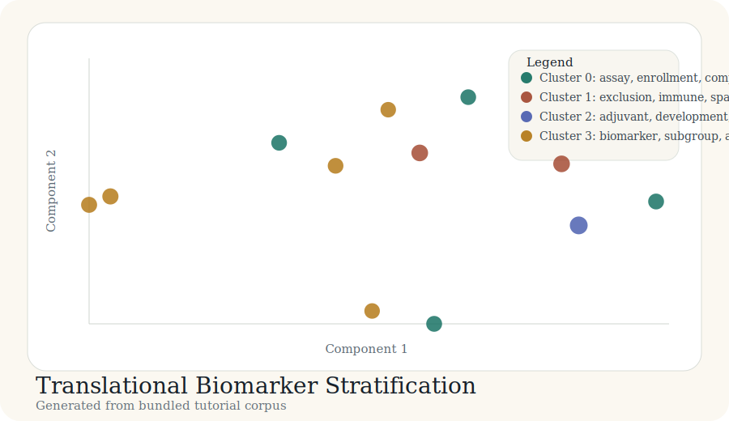

# Tutorial: Translational Biomarker Stratification

This tutorial focuses on biomarker strategy in translational development.
The outputs are generated from
`docs/tutorial-data/translational-biomarker-stratification.csv` by
`scripts/build_case_studies.py`.

## Background

Biomarker programs sit across assay development, patient stratification,
single-cell and spatial discovery, liquid biopsy, and subgroup-aware trial
design.

## Purpose

The goal is to see whether a compact translational corpus separates diagnostic,
resistance-biology, longitudinal monitoring, and adaptive-design themes.

## Data used

The bundled corpus contains 12 records spanning companion diagnostics, spatial
and single-cell biomarker discovery, liquid biopsy, and adaptive subgroup
methods.

## Code used

```python
records = load_records(DATA_DIR / "translational-biomarker-stratification.csv")
vocab, vectors, _ = build_tfidf(records)
centered, _ = center_vectors(vectors)
coords = project(centered, top_components(centered, 2))
labels, centroids = kmeans(vectors, 4)
```

## Results



| Cluster | Theme | Size | Mean probability |
| --- | --- | ---: | ---: |
| 0 | assay, enrollment, companion | 4 | 0.75 |
| 1 | exclusion, immune, spatial | 2 | 0.86 |
| 2 | adjuvant, development, disease | 1 | 1.00 |
| 3 | biomarker, subgroup, adaptive | 5 | 0.75 |

## Bundled artifacts

- [labels.csv](../case-studies/translational-biomarker-stratification/labels.csv)
- [cluster_summary.csv](../case-studies/translational-biomarker-stratification/cluster_summary.csv)
- [coords_2d.csv](../case-studies/translational-biomarker-stratification/coords_2d.csv)
- [map_interactive.html](../case-studies/translational-biomarker-stratification/map_interactive.html)

## Interpretation

This example shows that biomarker work is not a single layer. Diagnostic assay
operations, resistance biology, minimal residual disease work, and subgroup
design strategy show up as different neighborhoods on the map.
